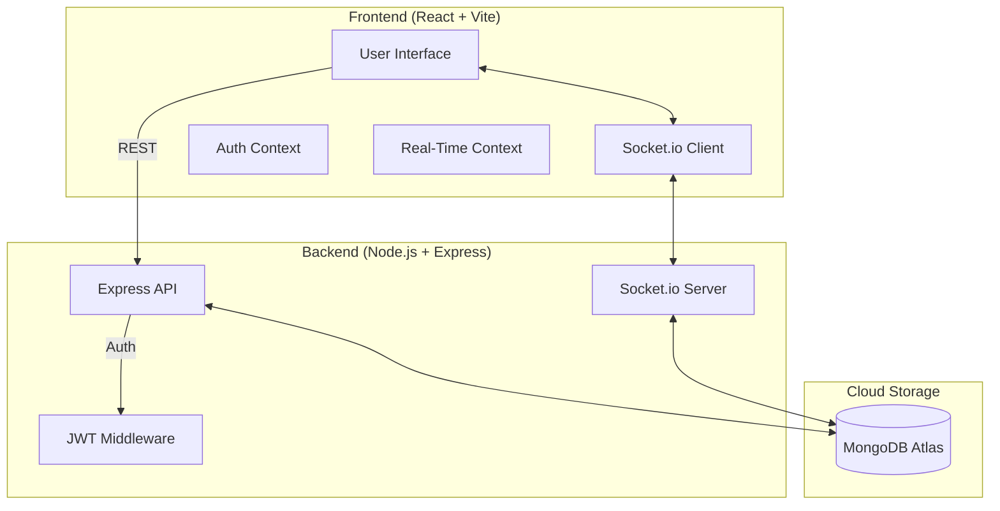
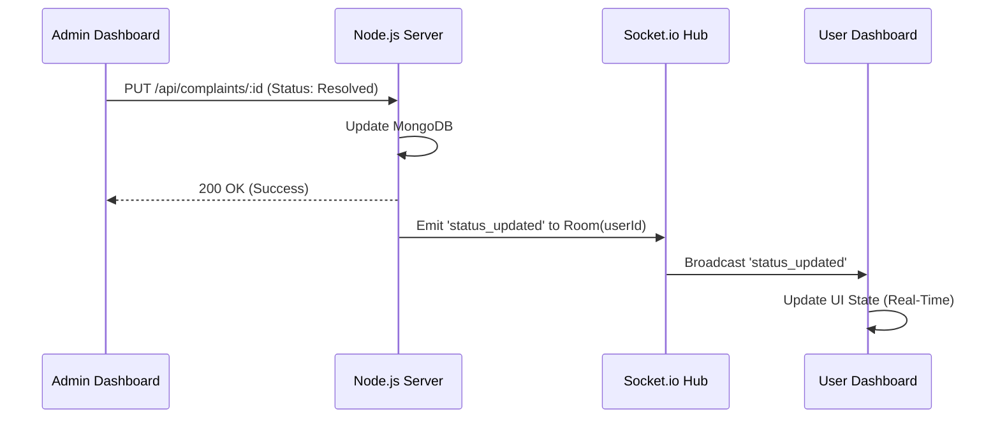
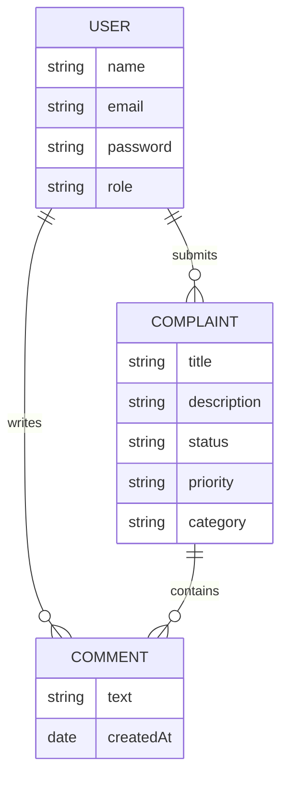
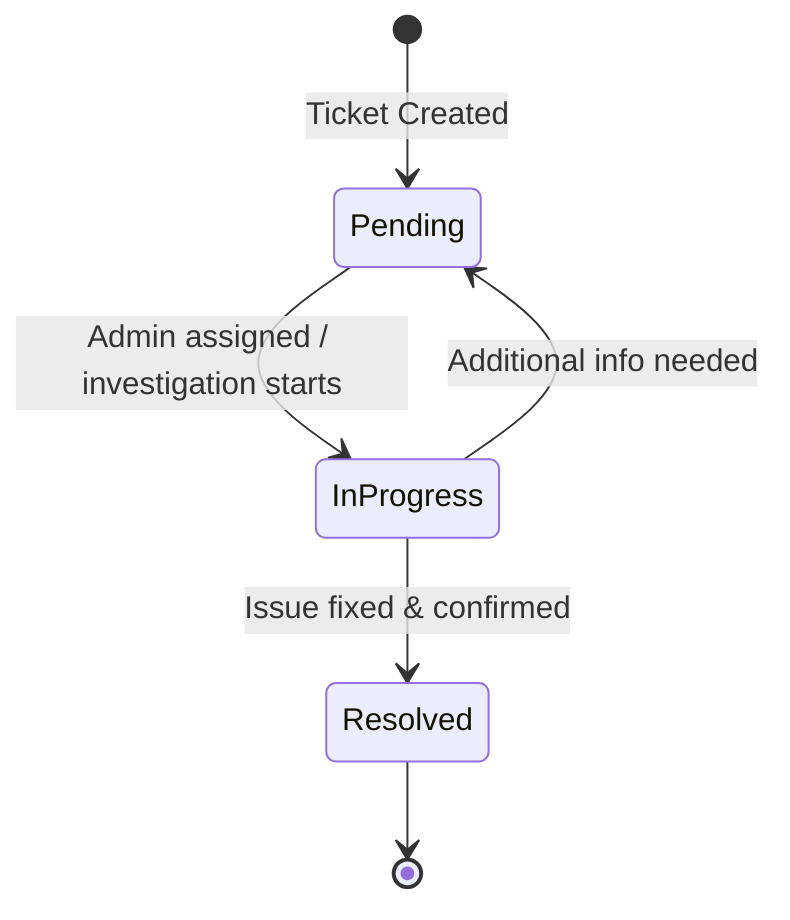

# 🧊 Smart Complaint Management System (SCMS) - Pro Edition

A high-fidelity, full-stack real-time platform designed for seamless issue tracking, collaborative resolution, and administrative intelligence. Built with the **MERN** stack and featuring a premium **"Clean Arctic" Light Mode** design.

---

## 🏗️ System Architecture

SCMS Pro uses a modern decoupled architecture with real-time bidirectional communication.

### 1. High-Level System Map


### 2. User Flow: Real-Time Communication
This diagram shows how a status update from an Admin is reflected instantly on the User's screen.



---

## 📂 Project Directory Structure

```text
everestqblog/
├── backend/                # Express.js Server
│   ├── middleware/         # Auth & Security Middlewares
│   ├── models/             # Mongoose Schemas (User, Complaint, Comment)
│   ├── routes/             # RESTful API Endpoints
│   ├── .env                # Server configuration (Secrets)
│   └── server.js           # Server Entry Point & Socket initialization
├── frontend/               # React Application (Vite)
│   ├── src/
│   │   ├── components/     # UI Components (Comments, etc.)
│   │   ├── context/        # Auth & Socket Context Providers
│   │   ├── pages/          # Viewports (Dashboards, Auth)
│   │   ├── App.jsx         # Routing & Protected Routes
│   │   └── index.css       # "Clean Arctic" Design System
│   └── vite.config.js      # Build & Proxy settings
└── README.md               # Documentation
```

---

## 🗄️ Database & Entity Relationships

The system maintains high relational integrity between accounts and their respective data entities.



---

## 🔄 Complaint Lifecycle

Tickets follow a strictly managed state machine to ensure accountability.



---

## 🛡️ Security Architecture

### 1. Authentication Flow
- **Password Hashing**: Passwords are never stored in plain text. We utilize `bcryptjs` with a salt factor of 10.
- **JWT Authorization**: Upon login, a JSON Web Token is signed with the `JWT_SECRET`.
- **Protected Routes**: The frontend implements a `ProtectedRoute` wrapper that verifies token presence and role authorization before rendering dashboards.

### 2. Socket Security
- **Room Isolation**: Users only join a Socket room mapped to their unique `userId`. This ensures they only receive real-time updates for their own complaints.

---

## 🌟 Pro Features Deep-Dive

### 🚀 Engine & performance
- **Socket.io Integration**: Low-latency bidirectional communication for instant UI reactivity.
- **Recharts Analytics**: Dynamic data visualization for Admin workload assessment.

### 📊 Management Tools
- **CSV Data Export**: One-click generation of Excel-compatible reports for auditing.
- **Priority Scaling**: Heat-mapped indicators (High/Red, Medium/Orange, Low/Grey) to manage urgency.

---

## 🚀 Installation & Deployment

### 1. Local Setup
```powershell
# Clone the repository
git clone https://github.com/Rahulchaube1/SCMS.git

# Install dependencies & run
./run.ps1
```

### 2. Environment Variables
| Key | Description |
| :--- | :--- |
| `PORT` | Local server port (default: 5000) |
| `MONGODB_URI` | MongoDB Atlas cluster connection string |
| `JWT_SECRET` | Secret key for signing authorization tokens |

### 3. Deployment Strategy
- **Frontend**: Deploy `frontend/` to **Vercel** or **Netlify**. Ensure `axios` base URLs are updated to your production API.
- **Backend**: Deploy `backend/` to **Render** or **Heroku**. Set your environment variables in the provider dashboard.

---

## 🎨 Design System: "Clean Arctic"
- **Background**: Soft #f8fafc with subtle indigo radial gradients.
- **Glassmorphism**: 70% opacity white backgrounds with 12px backdrop blur.
- **Badges**: Pastel-themed semantic indicators for Status and Priority.

---

> [!IMPORTANT]
> **Production Note**: Ensure your `MONGODB_URI` starts with `mongodb+srv://` or `mongodb://`. Without this, the authentication and ticket systems will not function as they require persistent storage.
