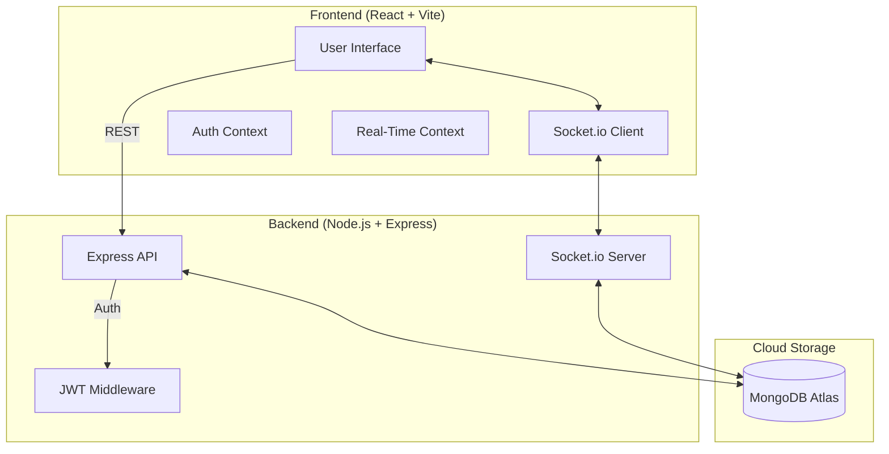

# 🧊 Smart Complaint Management System (SCMS) - Pro Edition

A high-fidelity, full-stack real-time platform designed for seamless issue tracking, collaborative resolution, and administrative intelligence. Built with the **MERN** stack and featuring a premium **"Clean Arctic" Light Mode** design.

---

## 🏗️ System Architecture

SCMS Pro uses a modern decoupled architecture with real-time bidirectional communication.



---

## 🌟 Key Features

### 🚀 Engine & performance
- **Real-Time Sync**: Powered by Socket.io, status updates and discussions reflect instantly across all sessions without refreshing.
- **Live Connection indicator**: Visual rotation icon in dashboards confirms active real-time connectivity.

### 🛡️ Secure access
- **Dual-Role Auth**: Dedicated flows for **Users** and **Administrators**.
- **Guest Access**: Instant demo capability via a secure shared guest session.
- **JWT Protection**: All sensitive routes are protected by JSON Web Token middleware.

### 📊 Management & analytics
- **Priority System**: Three-tier prioritization (**Low**, **Medium**, **High**) with visual heat-mapping.
- **Discussions**: Real-time comment threads on every ticket for collaborative troubleshooting.
- **Admin Intelligence**: 
  - **Analytics**: Visual distribution of statuses using Recharts.
  - **Exporting**: One-click **CSV download** for auditing and reporting.
  - **Smart Search**: Real-time filtering across the entire ticket database.

---

## 🗄️ Database Schema

### User Model
| Field | Type | Description |
| :--- | :--- | :--- |
| `name` | String | Full name of the user |
| `email` | String | Unique email for login |
| `password` | String | Hashed (Bcrypt) password |
| `role` | String | `user` or `admin` |

### Complaint Model
| Field | Type | Description |
| :--- | :--- | :--- |
| `title` | String | Brief summary of the issue |
| `description`| String | Detailed explanation |
| `category` | String | `Technical`, `Billing`, `General`, etc. |
| `status` | String | `Pending`, `In Progress`, `Resolved` |
| `priority` | String | `Low`, `Medium`, `High` |
| `userId` | ObjectId | Reference to the author (User) |

---

## 📡 API Endpoints

### Authentication
- `POST /api/auth/register` - Create a new account
- `POST /api/auth/login` - Authenticate and receive JWT
- `POST /api/auth/guest-login` - High-speed demo access

### Complaints
- `GET /api/complaints` - Fetch all complaints (Admin only, includes search/filter)
- `GET /api/complaints/user/:id` - Fetch tickets for a specific user
- `POST /api/complaints` - Submit a new ticket
- `PUT /api/complaints/:id` - Update status/priority (Admin only)

### Discussions
- `GET /api/complaints/:id/comments` - Fetch thread history
- `POST /api/complaints/:id/comments` - Post a real-time message

---

## 🚀 Installation & Setup

### 1. Prerequisites
- **Node.js** (v16+)
- **MongoDB Atlas** Account

### 2. Configure Environment
Create a `.env` file in the `backend/` directory:
```env
PORT=5000
MONGODB_URI=your_mongodb_connection_string
JWT_SECRET=your_jwt_signing_key
```

### 3. Quick Start
From the project root, run the multi-process starter:
```powershell
./run.ps1
```
*(Alternatively, run `npm install` in both `frontend` and `backend` directories first).*

---

## 🎨 Design System: "Clean Arctic"
- **Tokens**: Custom CSS variables for primary sapphire, slate text, and emerald success states.
- **Glassmorphism**: 70% opacity white backgrounds with 12px backdrop blur.
- **Shadows**: Low-altitude soft shadows for depth without clutter.

---

> [!IMPORTANT]
> **Production Note**: Ensure your `MONGODB_URI` starts with `mongodb+srv://` or `mongodb://`. Without this, the authentication and ticket systems will not function as they require persistent storage.
