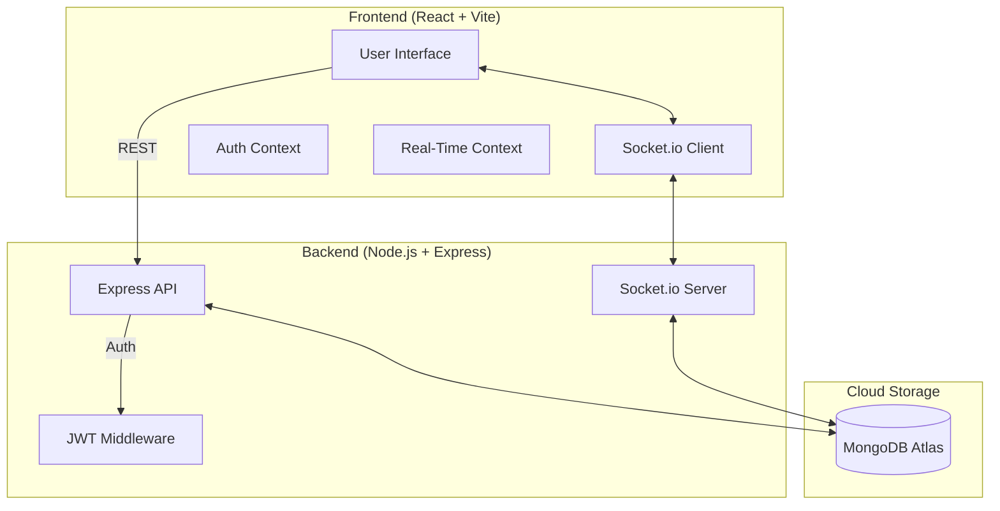
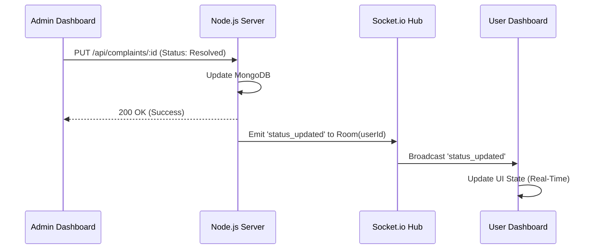
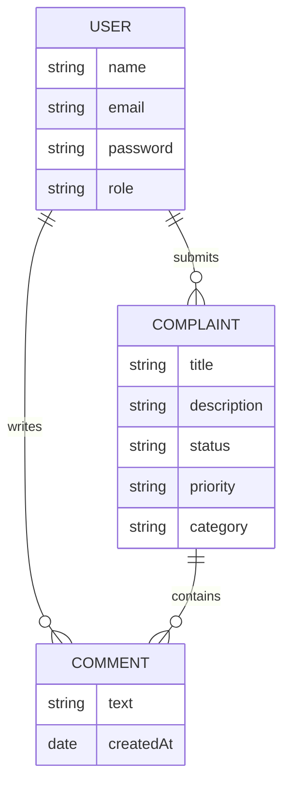
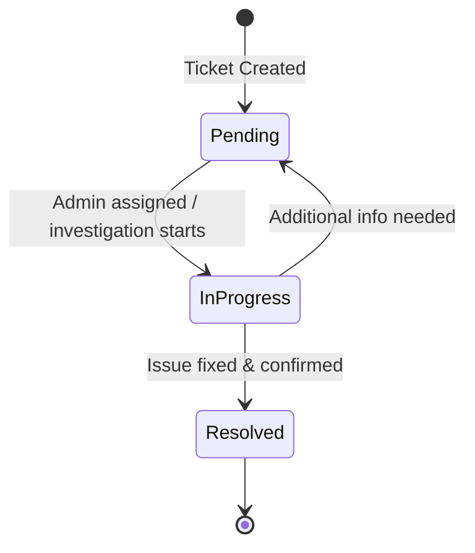

# 🧊 Smart Complaint Management System (SCMS) - Pro Edition

A high-fidelity, full-stack real-time platform designed for seamless issue tracking, collaborative resolution, and administrative intelligence. Built with the **MERN** stack and featuring a premium **"Clean Arctic" Light Mode** design.

---

## 🏗️ System Architecture

SCMS Pro uses a modern decoupled architecture with real-time bidirectional communication.

### 1. High-Level System Map


### 2. User Flow: Real-Time Communication
This diagram shows how a status update from an Admin is reflected instantly on the User's screen.



---

## 🗄️ Database & Entity Relationships

The system maintains high relational integrity between accounts and their respective data entities.



---

## 🔄 Complaint Lifecycle

Tickets follow a strictly managed state machine to ensure accountability.



---

## 🌟 Key Features

### 🚀 Engine & performance
- **Real-Time Sync**: Powered by Socket.io, status updates and discussions reflect instantly across all sessions without refreshing.
- **Live Connection indicator**: Visual rotation icon in dashboards confirms active real-time connectivity.

### 🛡️ Secure access & logic
- **Dual-Role Auth**: Dedicated flows for **Users** and **Administrators**.
- **JWT Protection**: Tokens are generated on login and required for all subsequent API requests.
- **Priority Intelligence**: Intelligent heat-mapping for tickets based on urgency.

### 📊 Management & analytics
- **Priority System**: Three-tier prioritization (**Low**, **Medium**, **High**).
- **Discussions**: Real-time comment threads on every ticket for collaborative troubleshooting.
- **Admin Intelligence**: 
  - **Analytics**: Visual distribution of statuses using Recharts.
  - **Exporting**: One-click **CSV download** for auditing and reporting.

---

## 🛠️ Component Breakdown (Frontend)

### Context Providers
1.  **AuthContext**: Manages the global authentication state, token persistence, and user role redirection.
2.  **RealTimeContext**: Establishes the Socket.io connection and manages room-joining logic based on the user's unique ID.

### Core Viewports
- **User Dashboard**: Focused on clean ticket submission and individual status tracking.
- **Admin Dashboard**: A high-density "Control Center" for bulk filtering, analytic visualization, and real-time status modulation.

---

## 📡 API Endpoints

### Authentication
- `POST /api/auth/register` - Create a new account
- `POST /api/auth/login` - Authenticate and receive JWT
- `POST /api/auth/guest-login` - High-speed demo access

### Complaints
- `GET /api/complaints` - Fetch all complaints (Admin only, includes search/filter)
- `GET /api/complaints/user/:id` - Fetch tickets for a specific user
- `POST /api/complaints` - Submit a new ticket
- `PUT /api/complaints/:id` - Update status/priority (Admin only)

### Discussions
- `GET /api/complaints/:id/comments` - Fetch thread history
- `POST /api/complaints/:id/comments` - Post a real-time message

---

## 🚀 Installation & Setup

### 1. Prerequisites
- **Node.js** (v16+)
- **MongoDB Atlas** Account

### 2. Configure Environment
Create a `.env` file in the `backend/` directory:
```env
PORT=5000
MONGODB_URI=your_mongodb_connection_string
JWT_SECRET=your_jwt_signing_key
```

### 3. Quick Start
From the project root, run the multi-process starter:
```powershell
./run.ps1
```

---

## 🎨 Design System: "Clean Arctic"
- **Tokens**: Custom CSS variables for primary sapphire, slate text, and emerald success states.
- **Glassmorphism**: 70% opacity white backgrounds with 12px backdrop blur.
- **Shadows**: Low-altitude soft shadows for depth without clutter.

---

> [!IMPORTANT]
> **Production Note**: Ensure your `MONGODB_URI` starts with `mongodb+srv://` or `mongodb://`. Without this, the authentication and ticket systems will not function as they require persistent storage.
