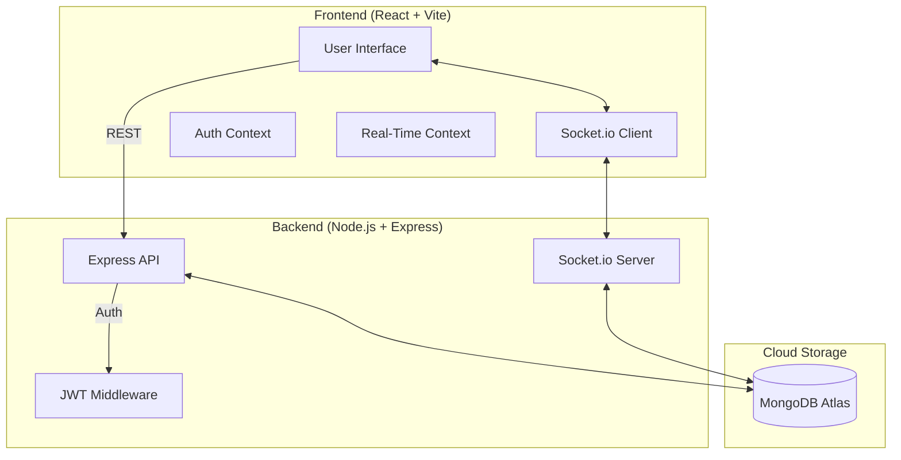
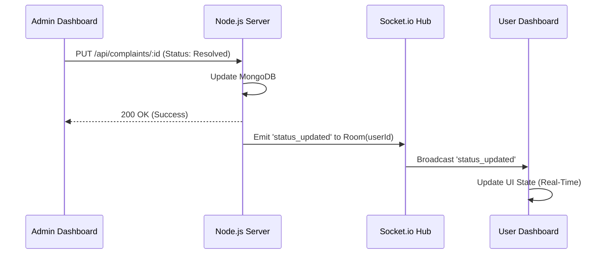
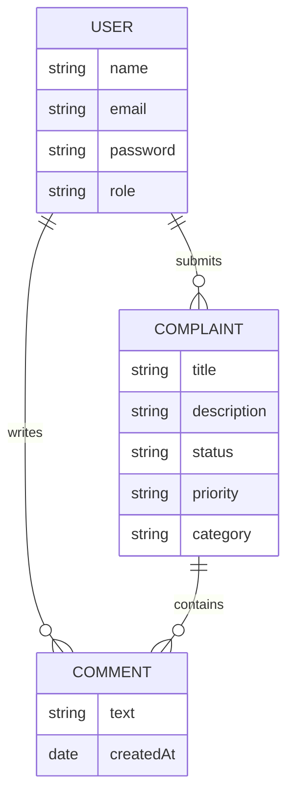
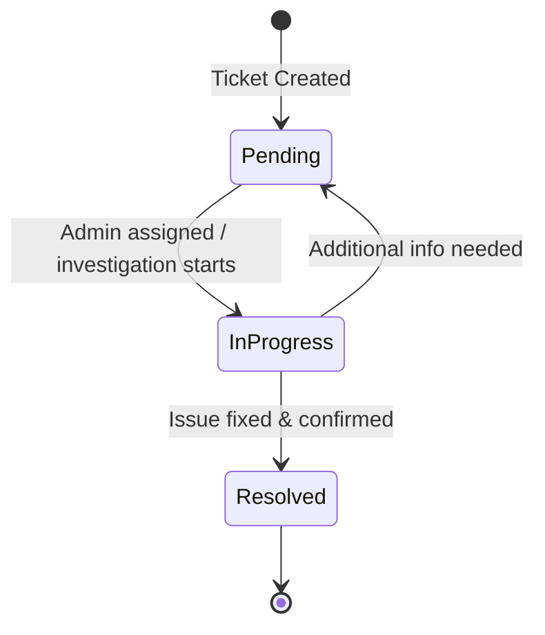

# Smart Complaint Management System (SCMS) - Pro Edition

The Smart Complaint Management System (SCMS) is a formal, high-fidelity, full-stack real-time platform designed for professional issue tracking, collaborative resolution, and administrative intelligence. It is built using the MERN stack (MongoDB, Express, React, Node.js) and features a premium Light Mode design system named "Clean Arctic."

---

## Problem Statement

Traditional complaint management systems often suffer from several critical bottlenecks that hinder organizational efficiency and user satisfaction:

1.  **Latency in Communication**: Feedback loops between users submitting issues and administrators resolving them are often slow, relying on page refreshes or manual email notifications.
2.  **Lack of Transparency**: Users frequently remain uninformed about the actual progress of their tickets, leading to repeated inquiries and frustration.
3.  **Data Fragmentation**: Information regarding specific issues is often scattered across different channels, making it difficult for administrators to have a unified view of the problem history.
4.  **Inefficient Prioritization**: Organizations struggle to manage high volumes of tickets without an automated way to categorize and weight issues based on urgency.
5.  **Limited Analytical Insight**: Managers often lack the real-time data visualization needed to identify systemic bottlenecks and workload distribution.

---

## The Solution

SCMS Pro addresses these challenges through a modern, integrated technical approach:

1.  **Real-Time Bidirectional Communication**: By utilizing WebSockets (Socket.io), the system ensures that every status update, priority change, or comment is reflected instantly on the relevant user and administrator dashboards without requiring a page reload.
2.  **Unified Collaboration Threads**: Each ticket includes a persistent discussion thread, allowing users and administrators to communicate directly within the context of the issue.
3.  **Intelligent Heat-Mapping**: The system incorporates a three-tier priority scale (Low, Medium, High) that allows administrators to sort and address the most critical issues first.
4.  **Actionable Intelligence**: Integrated administrative analytics provide real-time visual summaries of ticket distribution, allowing for better resource allocation.
5.  **Secure and Scalable Framework**: Built on a robust JWT-based authentication system and a scalable NoSQL database, the platform is designed to handle growth while maintaining strict data privacy.

---

## System Architecture

SCMS Pro uses a modern decoupled architecture with real-time bidirectional communication protocols.

### 1. High-Level System Map


### 2. User Flow: Real-Time Communication
This sequence diagram illustrates how a status update from an Administrator is reflected instantly on the User's interface.



---

## Project Directory Structure

```text
everestqblog/
├── backend/                # Express.js Server
│   ├── middleware/         # Auth & Security Middlewares
│   ├── models/             # Mongoose Schemas (User, Complaint, Comment)
│   ├── routes/             # RESTful API Endpoints
│   ├── .env                # Server configuration (Secrets)
│   └── server.js           # Server Entry Point & Socket initialization
├── frontend/               # React Application (Vite)
│   ├── src/
│   │   ├── components/     # UI Components (Comments, etc.)
│   │   ├── context/        # Auth & Socket Context Providers
│   │   ├── pages/          # Viewports (Dashboards, Auth)
│   │   ├── App.jsx         # Routing & Protected Routes
│   │   └── index.css       # Clean Arctic Design System
│   └── vite.config.js      # Build & Proxy settings
└── README.md               # Documentation
```

---

## Database and Entity Relationships

The system maintains high relational integrity between accounts and their respective data entities through a structured NoSQL schema.



---

## Complaint Lifecycle

Tickets follow a strictly managed state machine to ensure full accountability and visibility throughout the resolution process.



---

## Security Architecture

### 1. Authentication and Authorization
- **Password Hashing**: User credentials are protected using bcryptjs salted hashing, ensuring that sensitive data is never stored in plain text.
- **JSON Web Token (JWT)**: Upon successful authentication, a secure token is issued. This token is required for all authorized API interactions and is stored securely on the client side.
- **Role-Based Access Control (RBAC)**: The system strictly differentiates between 'user' and 'admin' roles, restricting critical administrative functions like priority changes and analytical data export to verified administrators.

### 2. Real-Time Security
- **Socket Room Isolation**: To maintain data privacy, each user session is confined to a unique Socket.io room identified by their user ID. This prevents cross-tenant data leakage during real-time broadcasts.

---

## Key Features

### Engineering and Performance
- **Socket.io Integration**: Implementation of low-latency bidirectional communication for instant interface updates.
- **Recharts Analytics**: Integration of dynamic data visualization for administrative workload assessment and trend analysis.

### Administrative Management Tools
- **CSV Data Export**: Single-click generation of Excel-compatible reports for auditing and compliance purposes.
- **Priority Scaling**: Visual heat-mapped indicators (High, Medium, Low) to assist in urgent ticket management.

---

## Installation and Deployment Guide

### 1. Local Environment Setup
To initialize the project locally, follow these steps:

1.  Clone the repository.
2.  Install dependencies for both the frontend and backend using `npm install`.
3.  Configure the environment variables in the backend as specified below.
4.  Execute the startup script: `./run.ps1`.

### 2. Environment Variables
The following environment variables must be defined in the `backend/.env` file:

- **PORT**: The local server port (default value is 5000).
- **MONGODB_URI**: The MongoDB Atlas connection string.
- **JWT_SECRET**: The secret key used for signing authorization tokens.

### 3. Deployment Strategy
- **Frontend**: The React application should be deployed to a static hosting provider like Vercel or Netlify. Ensure the API base URLs in the frontend source code are updated to the production backend URL.
- **Backend**: The Node.js server can be deployed to Render or Heroku. Configure the environment variables within the provider's management console.

---

## Design System: Clean Arctic
The SCMS Pro interface is built on the "Clean Arctic" system, focusing on high visibility and professional aesthetics:

- **Color Palette**: Utilizes soft neutrals for backgrounds and sapphire blue for primary interactive elements.
- **Visual Depth**: Implements glassmorphic containers with 70% opacity and 12px backdrop blur.
- **Semantic Indicators**: Uses high-contrast pastel badges for status and priority tracking to reduce cognitive load.

---

> [!IMPORTANT]
> **Production Requirement**: A valid MONGODB_URI is essential for system functionality. Ensure your connection string starts with `mongodb+srv://` or `mongodb://`. Without this connection, the authentication and database operations will fail.
